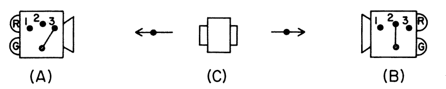
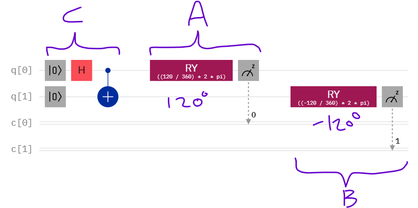

Entanglement is the weirdest feature of quantum mechanics. David Mermin (1981) provides an accessible introduction to experiments showing that local determinism doesn't hold in the quantum world, simplifying [Bell's theorem](https://plato.stanford.edu/entries/bell-theorem/) and tests thereof. This post shows the sums in R.

First, a diagram of the setup (Mermin, 1981, p. 400):




We have a device, *C*, that fires out two particles to detectors *A* and *B*. The detectors have three measurement settings, 1, 2, and 3, and two lights, red (R) and green (G), which indicate the measurement outcome. *A* and *B* do not communicate with each other in any way and it is assumed that the measurement settings are independent of each other.

If you can read bra--ket notation, then the quantum state of the particles fired out by *C* is the entangled [Bell state](https://en.wikipedia.org/wiki/Bell_state), $|\Phi^+\rangle$:


$$|\Phi^+\rangle = \frac{|R\rangle_A \otimes |R\rangle_B + |G\rangle_A \otimes |G\rangle_B}{\sqrt{2}} = \frac{|RR\rangle + |GG\rangle}{\sqrt{2}}$$

What this means in words is that when the measurement settings on *A* and *B* are the same, e.g., both 1 or both 2, then the same lights always flash on *A* and *B* when the particles arrive. They are either both red or both green, with equal probability. If the measurement settings are different then, as we see later, sometimes the lights flash the same colour and other times they flash different colours.

One way to make this work is to assume the particles somehow encode what the measurement outcome will be for each of the three settings (local determinism), it's just that this is generally hidden from experimenters. The particles heading left and right would then encode the same information. We can write this as a three-character string. *RGR* would denote that the outcome is red for setting 1, green for setting 2, and red for setting 3.

In this way, it's easy to see that the same light will flash at the two detectors when the measurement settings are the same.

Now suppose each measurement setting is chosen randomly with equal probability and the settings at *A* and *B* are independent. What happens when the settings are *different*?

Here's the setup. <tt>a</tt> and <tt>b</tt> give the measurement settings at *A* and *B*. <tt>o1</tt>, <tt>o2</tt>, and <tt>o3</tt>, give the outcome for the three measurement settings, so concatenating them together gives the three-character string, <tt>hidden</tt>. The R code below generates all $8 \times 9 = 72$ possibilities from the $2^3 = 8$ possible particle setups and the $3^2 = 9$ different combinations of measurement settings at *A* and *B*.

```{r message=FALSE, warning=FALSE}
library(tidyverse)
```

```{r}
dat <- expand.grid(
  a = 1:3,
  b = 1:3,
  o1 = c("R", "G"),
  o2 = c("R", "G"),
  o3 = c("R", "G")
) |>
  mutate(A = case_when(a == 1 ~ o1,
                       a == 2 ~ o2,
                       a == 3 ~ o3),
         B = case_when(b == 1 ~ o1,
                       b == 2 ~ o2,
                       b == 3 ~ o3),
         hidden = paste0(o1, o2, o3),
         same = A == B)
dat |> select(-c(o1,o2,o3))
```

Now we can see how the probability of getting the same outcome depends on whether the measurement settings are the same:

```{r}
dat |>
  group_by(a == b) |>
  summarise(`P(Same outcome)` = mean(same))
```

The outcomes are always the same if the settings are the same and have a 50--50 chance of being the same if the settings are different. This differs from the predictions of quantum mechanics and empirical findings from actual experiments.

To see this, let's view the entangled particles fired from *C* as qubits, abstracting from Mermin's discussion of spin-1/2 particles and Stern--Gerlach magnets. The measurement settings of *A* and *B* are then implemented as rotating the qubit entering the detector about the y-axis using an [RY gate](https://qiskit.org/documentation/stubs/qiskit.circuit.library.RYGate.html). After this rotation, we measure using the computational basis.

Here's a quantum circuit with example settings:



The circuit for *C* establishes a Bell state by using a Hadmard gate and CNOT.

The probability that the outcomes are the same at *A* and *B* is given by $\cos^2(\theta/2)$, where $\theta$ is the difference between angles of rotations at *A* and *B*. (We're squaring because [Born rule](https://en.wikipedia.org/wiki/Born_rule).)

Following Mermin (1981), we choose angles $0^{\circ}$, $-120^{\circ}$, and $120^{\circ}$ for the three measurement settings. <tt>ang_diff</tt> gives the difference in the angles in degrees; <tt>ang_diff_rads</tt> is the same in radians.

Here is a table of the outcomes:

```{r}
dat_actual <- expand.grid(a = c(-120,0,120), b = c(-120,0,120)) |>
  mutate(ang_diff          = b - a,
         ang_diff_rads     = (ang_diff/360) * 2 * pi,
         `P(Same outcome)` = cos(ang_diff_rads/2)^2)
dat_actual |> 
  select(-ang_diff_rads) |>
  arrange(abs(ang_diff), a)
```

When the settings are the same at *A* and *B*, the findings agree with local determinism: the lights always flash the same colour. However, when the settings are different, the lights are the same colour on only $1/4$ of trials. This is lower than the $1/2$ predicted by the local determinism setup, so something else is going on. Local determinism is false.

Out of curiosity, I gave the circuit above a go on an IBM Quantum computer (ibmq_jakarta). The measurement outcomes were the same on `r 13.8+12.8`% of 1,000 trials, 95% CI = [23.9%, 29.5%]. This confidence interval includes the prediction of quantum mechanics and is well below 50%.

There are values of $\theta$ for which the local determinism predictions do work, e.g., $\frac{\pi}{2}$ radians = $90^{\circ}$:

```{r}
cos((pi/2)/2)^2
```
But that clearly doesn't rescue it.

Hossenfelder and Palmer (2020) would want to emphasise that this falsification of local determinism assumes that the measurement settings are statistically independent, which they argue isn't true. Allowing the measurement settings to be correlated is known as *superdeterminism*.


### References

Mermin, N. D. (1981). [Quantum Mysteries for Anyone](https://www.jstor.org/stable/2026482). *The Journal of Philosophy*, *78*(7), 397--408.

Hossenfelder, S., & Palmer, T. (2020). [Rethinking Superdeterminism](https://doi.org/10.3389/fphy.2020.00139). *Frontiers in Physics*, *8*, 139.


